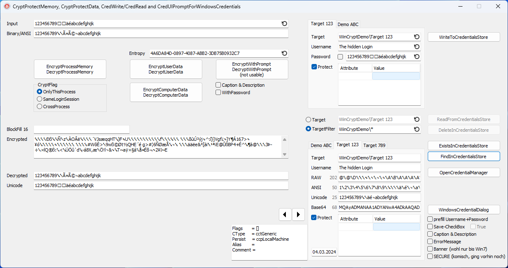

# Windows Credentials & Cryptography

Daten ohne Passwort verschlüsseln, mit Keys des aktuellen Prozesses, Benuters oder der Windows-Installation.

Passwörter und Schlüssel im Anmeldeinformationsspeicher des Windows hinterlegen.

---

Passwörter, Schlüssel und Ähnliches in der Anmeldeinformationsverwaltung des aktuellen Nutzers speichern.

    Name := 'username';
    Pass := 'password';
    WinCrypt.WriteToCredentialsStore('TheTarget', Name, Pass);

    if WinCrypt.ReadFromCredentialsStore('TheTarget', Credential) then
      ShowMessage(Credential.Name + ' : ' + Credential.Passw);

    CredentialArr := WinCrypt.FindInCredentialsStore('TheTarget*');
    for var Cred in CredentialArr do
      ShowMessage(Cred.Name + ' : ' + Cred.Passw);

    // [WIN] Anmeldeinformationsverwaltung > Windows-Anmeldeinformation
    // control.exe /name Microsoft.CredentialManager
    WinCrypt.OpenCredentialManager;

Passwort-Dialog des Betriebssystems benutzen.

    var Username, Password: string;
    if WinCrypt.WindowsCredentialDialog(Username, Password {, nil, Self}) then
      ShowMessage(Username + ' / ' + Password);

    var Username: string := 'name';
    var Password: string := 'pass';
    var Save: LongBool   := False;
    if WinCrypt.WindowsCredentialDialog(Username, Password, @Save, Self, 'Caption', 'The Desription') then
      ShowMessage('Save=' + Save.ToString + ': ' + Username + ' / ' + Password);

---

Daten mit einem Kontext der aktuellen Prozess ver-/entschlüsseln.
Nur innerhalb der aktuellen Prozess-Intsanz entschlüsselbar, oder während der aktuellen Login-Session, oder
z.B. um ein Passwort während der Laufzeit zu schützen, damit es nicht in der Auslagerungsdatei, bei einem ReadProcessMemory oder über ein Prozess-Abbild lesbar ist. (nur ganz kurz während der Verwendung)

    var Data: TBytes = TEncoding.UTF8.GetBytes('1234567890123456');  // Length = Multiple of 16 bytes
    WinCrypt.EncryptProcessMemory(Pointer(Data), Length(Data {, OnlyThisProcess});

    WinCrypt.DecryptProcessMemory(Pointer(Data), Length(Data {, OnlyThisProcess});
    ShowMessage(TEncoding.UTF8.GetString(Data));

Daten mit dem Schlüssel des Benutzers ver-/entschlüsseln.
Nur für Programme im Kontext des aktuell angemeldeten Windows-Benutzers.

    var Data: TBytes = TEncoding.UTF8.GetBytes('abc123');
    WinCrypt.EncryptUserData(Data);

    WinCrypt.DecryptUserData(Data);
    ShowMessage(TEncoding.UTF8.GetString(Data));

Daten mit dem Schlüssel des Computers ver-/entschlüsseln.
Nur für Programme, welche in dieser Windows-Installation laufen.

    var Data: TBytes = TEncoding.UTF8.GetBytes('abc123');
    WinCrypt.EncryptComputerData(Data);

    WinCrypt.DecryptComputerData(Data);
    ShowMessage(TEncoding.UTF8.GetString(Data));

